[](https://travis-ci.org/jean553/c-data-structures)

Taiga project: https://tree.taiga.io/project/jean553-jean553c-data-structures

# c-data-structures

Attempt to implement common data structures in C.

## Requirements

### Ubuntu/Debian

```bash
apt-get install gcc cmake check
```

### Archlinux

```bash
pacman -S gcc cmake check
```

## Compilation

```bash
mkdir build && cd build/
cmake ..
make
```

## Tests execution

```bash
ctest --output-on-failure .
```

## Create individual libraries

In the example below, we create a library for the linked list.

```bash
cd linked_list/
gcc -c -fpic linked_list.c
gcc -shared -o liblinkedlist.so linked_list.o
```

Export the path for dynamic imports:

```bash
export LD_LIBRARY_PATH={directory of your *.so file}
```

## Documentation

### Installation

#### Ubuntu/Debian

```bash
apt-get install doxygen
```

#### ArchLinux

```bash
pacman -S doxygen
```

### Documentation

```bash
doxygen
```

# List of data structures

Lists:
 * linked list,
 * double linked list,
 * self-organized list, 
 * unrolled linked list,
 * XOR double linked list,
 * circular linked list,
 * skip list,

Trees:
 * binary tree,
 * binary search tree,
 * red black tree,

Tries:
 * trie,

Others:
 * vector - dynamic array,
 * hashmap

## Lists

NOTE: the following data structures have not been created in this project:
 * `tuples`: finite ordered list of items that can have different types, accessed by index or key, they are `structures` in C,
 * `fixed array`: finite ordered list of items that have the same type, accessed by index, they are `arrays` in C.

### Linked list

Each node contains the data itself and a pointer to the next node.

```
+-----------+-----------+          +-----------+-----------+           +-----------+-----------+
|           |           |          |           |           |           |           |           |
|   Data    |  Pointer  +--------> |   Data    |  Pointer  +---------> |   Data    |  Pointer  +------>  NULL
|           |           |          |           |           |           |           |           |
+-----------+-----------+          +-----------+-----------+           +-----------+-----------+
```

The implemented methods are:
 * create
 * insertAtTheEnd
 * insertAtTheBeginning
 * at
 * size
 * all
 * insertAfter
 * dropAt
 * dropAtTheEnd

Pros:
 * The size is not fixed
 * Fast read and write operations with small lists
 * Inserting and removing don't require data copy

Cons:
 * slow read and write operations with long lists ( O(n) )

### Double linked list

Each node contains the data itself and two pointers.
The first one is pointing to the previous node,
the second one is pointing to the next node.

P : Previous
D : Data
N : Next

```
    +-----------------+      +-----------------+      +-----------------+
    |     |     |     |      |     |     |     |      |     |     |     |
 <--+  P  |  D  |  N  +--->  |  P  |  D  |  N  |  <---+  P  |  D  |  N  +-->
    |     |     |     |      |     |     |     |      |     |     |     |
    +-----------------+      +-----------------+      +-----------------+
              ^                 |           |                 ^
              +-----------------+           +-----------------+
```

The implemented methods are:
 * create
 * insertAtTheEnd
 * insertAtTheBeginning
 * insertAfter
 * at
 * size
 * all

Pros:
 * the size is not fixed
 * can be browsed in both directions
 * inserting/removing does not require to copy the data

Cons:
 * take more space than a simple linked list

### Self-organizing list

A simple linked list that automatically updates its nodes order.
The order is updated according to the usage frequency of each node.

The implemented methods are:
 * atWithMTF - like at() and applies `Move To Front` method
 * atTranspose - like at() and applies `Swapping` method

#### Move To Front

Everytime a node is requested, the node is moved to the head of the list.

Pros:
 * no additional data into the linked list (standard linked list can be used)

Cons:
 * not accurate: simply moves to the top every requested node,
the algorithm does not include any average consideration of nodes usage. 

#### Swapping method

Everytime a node is requested, the selected node is swapped with the previous one.

Pros:
 * accurate compare to MTF, nodes move according to the frequency they are requested and they move progressively to the head

Cons:
 * takes many accesses to move one node to the head

## Unrolled linked list

```
        +--------------------------------+
        | +----------------------------+ |
        | |    ||    ||    ||    ||    | |
        | | 0  || 1  || 2  || 3  || 4  | +----+
        | +----------------------------+ |    |
        +--------------------------------+    |
                                              |
  +-------------------------------------------+
  |
  |     +--------------------------------+
  |     | +----------------------------+ |
  |     | |    ||    ||    ||    ||    | |
  +---> | | 5  || 6  || 7  || 8  || 9  | +-->  NULL
        | +----------------------------+ |
        +--------------------------------+
```

The unrolled linked list is a linked list that contains arrays.
All the arrays have the same size, this size is set during the list creation.

Implemented methods:
 * createULL
 * atULL
 * insertAtTheEndULL

Pros:
 * access to an item by index can be faster because the last browsing step
is performed by array indexing,

Cons:
 * inserts in the middle are expensives (every item of arrays of all of nodes have to be shifted)

### XOR Double linked list

A double linked list that only uses one pointer per node to go to the previous or next node.
A bitwise XOR operation is applied on the node address field when inserting and reading;
by this way, the list can find the next or previous node.

```
+---------+  +---------+  +---------+  +---------+
|    a    |  |    b    |  |    c    |  |    d    |
+---------+  +---------+  +---------+  +---------+
| b XOR 0 |  | a XOR c |  | b XOR d |  | c XOR 0 |
+---------+  +---------+  +---------+  +---------+

+------------------------------------------------>

<------------------------------------------------+
```

Implemented methods:
 * create
 * insert
 * at

### Circular linked list

The circular linked list is a linked list without head and tail.
The last node simply points to the first one.

```
+----+        +----+        +----+
| 10 +----->  | 20 +------> | 30 |
+-+--+        +----+        +--+-+
  ^                            |
  |                            |
  +----------------------------+
```

Implemented methods:
 * create
 * insertAtTheEnd
 * insertAtTheBeginning
 * at

NOTE: In such kind of list, at(5) in the list [1,2,3,4] returns 2.

### Skip list

```
 +------+  +-------+                                +-----+
 | head |  |level 3+------------------------------> |  7  +------------------------------>  NULL
 +------+  +-------+                                +-----+
               |                                       |
               v                                       v

           +-------+                                +-----+                   +-----+
           |level 2+------------------------------> |  7  +-----------------> |  9  +---->  NULL
           +-------+                                +-----+                   +-----+
               |                                       |                         |
               v                                       v                         v

           +-------+                   +-----+      +-----+                   +-----+
           |level 1+-----------------> |  6  +----> |  7  +-----------------> |  9  +---->  NULL
           +-------+                   +-----+      +-----+                   +-----+
               |                          |            |         
               v                          v            v                         v
               
           +-------+      +-----+      +-----+      +-----+      +-----+      +-----+
           |level 0+----> |  4  +----> |  6  +----> |  7  +----> |  8  +----> |  9  +---->  NULL
           +---+---+      +--+--+      +--+--+      +--+--+      +--+--+      +--+--+
               |             |            |            |            |            |
               v             v            v            v            v            v
             NULL           NULL         NULL         NULL         NULL  
```

The skip list provides different lanes of nodes to access data quicly.
On each lane, every nodes are ordered by key. Every node points on one data item.
The nodes with the same key point to the same data item.

Implemented methods:
 * create
 * insert
 * at
 * all

## Trees

### Binary tree

The binary tree is a tree in which one every node has at most two children.

The `strict` binary tree has every nodes with exactly zero or two children.
The `complete` binary tree has every level fullfilled (the last one may not be fullfilled),
and all nodes are as left as possible.
The `perfect` binary tree has every level filled.

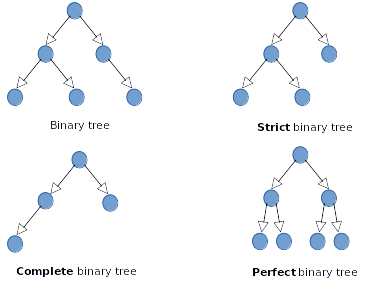

The `root` node is the top node of the tree. A `leaf` node is a node on the last level of the tree.
The `height of a binary tree` is the number of node(s) between the root node to any one of the leaf node.

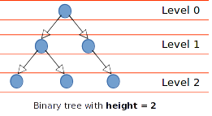

Find N the maximum nodes of a binary tree with a height of H:
`N = 2^(H+1) - 1`

Find H the height of a binary tree of N nodes:
`H = log2(N+1) - 1` 

Find H the minimum height of a binary tree of N nodes:
`H = log2(N)`

Find H the maximum height of a binary tree of N nodes:
`H = N - 1`

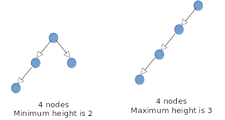

Most of the time, we always want to keep the binary tree with a height as small as possible;
we call that kind of tree a `balanced` tree.

A binary tree is `balanced` when the difference the height of the left sub-tree and
the height of the right sub-tree is equal to 0 or 1.

The difference D between two sub-nodes of a given node can be calculated
with the height HL of the left sub-node and the height HR of the right sub-node:
`D = |HL - HR|`

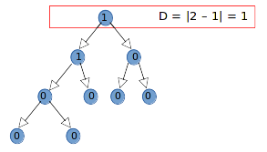

In a perfect tree, the difference of every node is 0.

In programming, a binary tree can be built with `pointers` or with an `array`.

Access the left item N of the node I in a binary tree stored as an array:
`N = I * 2 + 1`

Access the right item N of the node I in a binary tree stored as an array:
`N = I * 2 + 2`

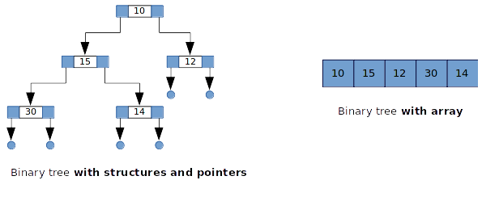

### Binary Search Tree (BST)

The binary search tree is a binary tree in which one for each node, the values
of all the nodes in the left sub-tree is lesser or equal to the current node,
and the values of all nodes in the right sub-tree is greater to the current node.
The binary search tree is an ordered binary tree.

Binary search trees are used to access data faster (read and write)
than basic binary tree.

For example, let's considere a list of 1 million items (10^6).
Let's considere that the computer that has to find one item in this list
is able to make one comparision process in 10^-5 seconds.
The computer has to compare the searched value with every value of the list.
It would take 10 seconds maximum to find the result.
The binary search tree is a solution to this "long time search" problem.

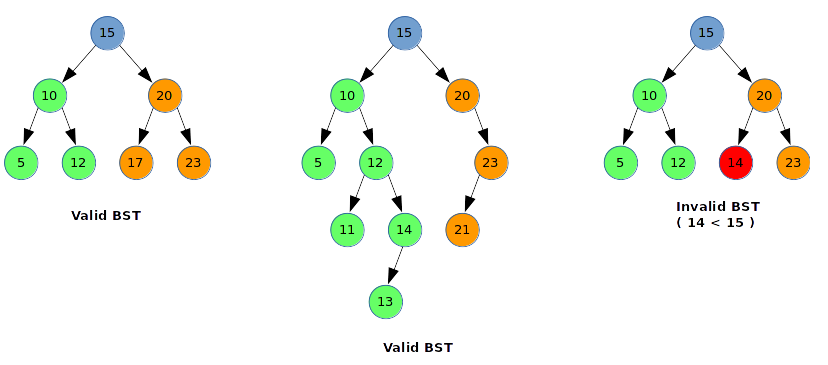

Binary search trees make `Binary search` possible: when binary search is applied,
a specific value is searched. This searched value is compared to the root node value;
if the searched value is lesser or equal than the root node value,
the search goes to the left sub-tree and the same operation is applied;
if the searched value is greater than the root node value,
the search goes to the right sub-tree and the same operation is applied.

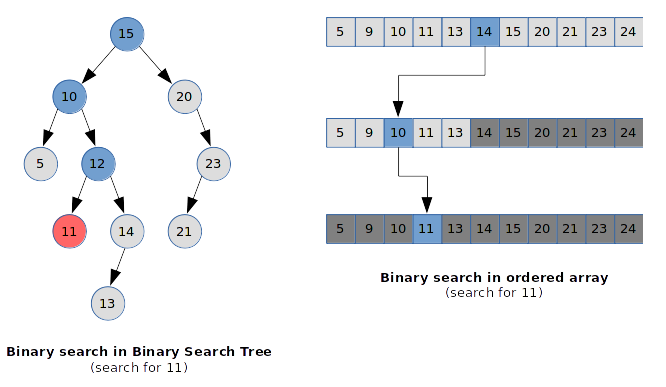

In the best case, we need `log2(n)` steps to find an item in a binary search tree
(where `n` is the total amount of items). This is the case for balanced binary search tree.

In the worst case, we need `n` steps to find an item in a binary search tree
(for exemple, last item of a linked list, which is a not balanced binary search tree, even if ordered).

Implemented methods:
 * create
 * insert
 * search
 * removeAt

### Red black tree

The red black tree is a binary search tree that ensures self-balancing when inserting.
In fact, one of the binary search tree main problem is that according to how the insertions are done,
an efficient binary tree can simply become a linked list.
The access time complexity can literally decrease.

The red black tree node is the same as the BST node with one more parameter called the color.
The color is an attribute of every node that can be Black or Red.
The nodes are inserted into the tree the same way as a standard BST
and a "self-balancing" procedure is applied on the tree right after the node insertion.
During this process, the color of one or many nodes may change in order to respect a set of rules.
This set of rules ensure the tree stay balanced.

These rules are:
 * the root node is always black,
 * the leaf nodes of the tree are always black,
 * every red node always have exactly two black children,
 * all paths from one node to a leaf node have the same amount of black nodes
Note that a NULL node of any other node is considered as black.

The self-balancing process simply tries to detect some violations of these rules right after a node insertion.
Those violations are recurrent and the solutions to fix them are predefined.

#### Violations

##### Violation 1: Insert a node with red parent and red uncle

This violation occurs when a new (red) node is added right after a red node:
a red node can only have two black children exaclty (or two NULL children).
When the uncle node of the new node is red, a predefined solution can be applied:
the parent and the uncle become black, the parent of the uncle become red.

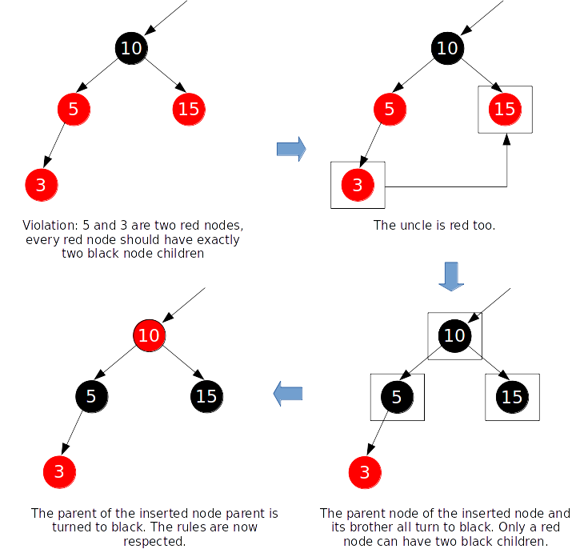

##### Violation 2: Insert a left node with red parent (left node too) and black uncle

This violation occurs when:
 * a new (red) node (left node) is added right after a red node
 * the parent node itself is a left child node
 * the uncle of the inserted node is black

The predefined solution for this violation is to:
 * invert the inserted parent node with its own parent, without inverting the colors,
 * rotate the inserted parent node with its own parent

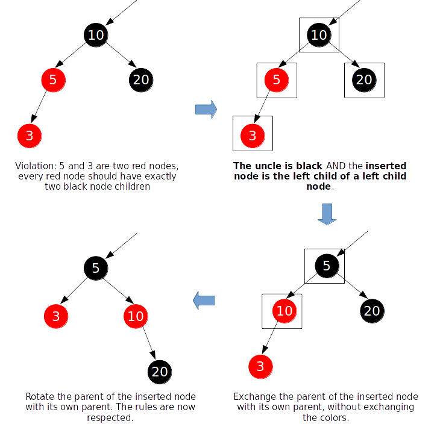

##### Violation 3: Insert a left node with red parent (right node) or insert right node with a red parent (left node) and black uncle

This violation occurs when:
 * a new (red) node is added right after a red node
 * the new inserted node is a left node of a right node OR the new inserted node is a right node of a left node
 * the uncle of the inserted node is black

The predefined solution for this violation is to:
 * rotate the new inserted node with its own parent in order to have the condition of the violation 2
 * apply the solution of the violation 2

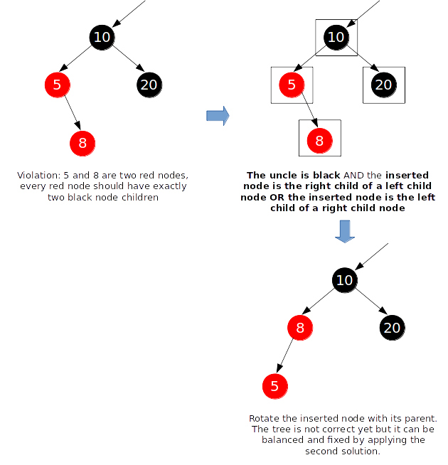

## Tries

### Trie

A trie is a structure in which one every node does not have its own key
but instead the key is part of the node and its parents keys.

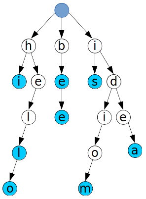

The trie above contains the following words:
 * hi,
 * hell,
 * hello,
 * be,
 * bee,
 * is,
 * idiom,
 * idea

The blue circles indicates the end of one of these words.

This trie can be used for two use cases:
 * search words from a dictionary (we simply have to browse the trie character by character to know if a word exists),
 * key/value storage where every node contains data or a pointer to the data; in that case, every node can have a key even if it is not a valid word (ex: h, he, hel, b, ide, idi, idio)

The implemented methods are:
 * create
 * keyExists
 * insert

During insertion and creation, a whole string is given as parameter and inserted into the trie.
During searching, a whole string is given and used to browse the trie.

In order to store the trie into memory and being able to browse it,
every trie node stores a pointer to a linked list node that contains all its children (every linked list node contains a pointer to a child).

## Others

### Vector - Dynamic array

An array is a set of continuous data in memory.
A vector is a dynamic array (the allocated size can vary).

```
     +-----------------------+
     |       |       |       |
     |   A   |   B   |   C   |
     |       |       |       |
     +-----------------------+
         ^
         |
         |
         |
         +
       ARRAY
```

The implemented methods are:
 * create
 * insertAtTheEnd
 * insertAt
 * updateAt
 * at
 * size
 * resize

Pros:
 * read and write is fast, because we use a pointer to directly jumps at the expected index

Cons:
 * the size is fixed because memory has to be allocated once in order to ensure that all the nodes are contiguous;
 * "dynamic" insertion requires to reallocate the memory
 * insert into the array requires to copy (shift) many nodes

### Hashmap

A hashmap is a map that stores data with unique key/value pairs.
When inserting data into the hashmap, a hash of the key is generated;
this hash is the 'address' of the data, used for future updates and research.

```


                                                          +------------------+
                                                          | 55  |            |
                                                          +------------------+
  {'key1':'value1'}  +--->   hash('key1') = 56   +----->  | 56  |   value1   |
                                                          +------------------+
                                                          | 57  |            |
                                                          +----------------------------------+
  {'key2':'value2'}  +--->   hash('key2') = 58   +----->  | 58  |   value 2  |     value3    |
                                                    |     +----------------------------------+
                                                    |
                                                    |                   ^               ^
  {'key3':'value3'}  +--->   hash('key3') = 58   +--+                   |               |
                                                                        |               |
                                                                        +---------------+
                                                                                |
                                                                                |
                                                                               ++
                                                                           Compare keys
                                                                           if collision

```

Insertion steps:
 * data is inserted using a key/value pair,
 * a hash of the key is generated by a common hash function,
 * the value is inserted at the hash address in the array (the key is inserted with its value),
 * if many keys have the same hash (collision), the new node is inserted just after the others (linked list),
 * both of the key and the hash method are used to find data (the keys of the same linked list are browsed if many nodes have the same hash)

Implemented methods:
 * create
 * insert
 * at
